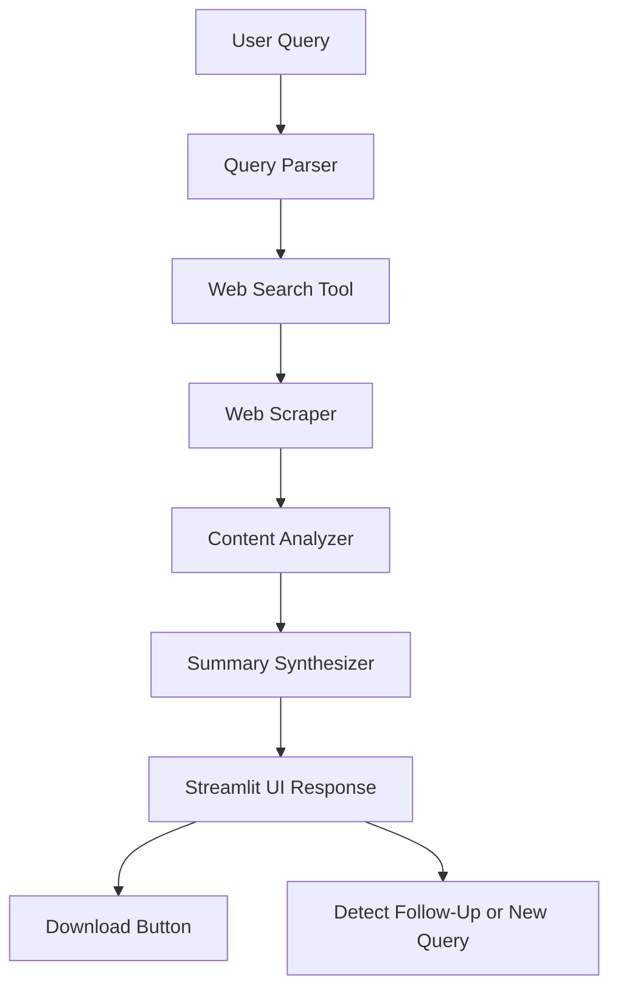

# Web Research Agent

🤖 An AI-powered Web Research Agent built using **Streamlit** + **Google Gemini** APIs.  
It intelligently analyzes user queries, searches the web, scrapes information, and generates clean, accurate research summaries with minimal human input.

---

## 📌 Features

- ✨ Understands complex user queries and breaks them into search-friendly keywords
- 🔎 Searches the web for real-time information
- 🖥️ Scrapes and extracts relevant content from web pages
- 🧠 Analyzes and synthesizes multiple sources into a cohesive final research report
- 🔁 Detects and handles follow-up queries vs new queries intelligently
- 📥 Allows easy downloading of full research summaries
- 🛡️ Handles errors like quota limits, no results found, and scraping failures gracefully
- 🎛️ Model Switching: Choose between **Gemini-1.5-Pro** or **Gemini-1.5-Flash** dynamically
- ✅ Unit tested with Pytest to ensure stability

---

## 🏗️ Architecture (Agent Flow)



---

## 🛠️ Tools Used

| Component | Tool | Description |
|:----------|:-----|:------------|
| AI Model | Google Gemini 1.5 Pro / Flash | For summarizing and synthesizing |
| Search | WebSearchTool (Serper API simulated) | Perform Google-like searches |
| Scraping | WebScraper (BeautifulSoup) | Extract text from websites |
| Content Analysis | ContentAnalyzer | Summarize scraped content |
| Query Analysis | QueryParser | Break down queries into search keywords |
| Framework | Streamlit | Frontend UI |
| Testing | Pytest | Unit testing core modules |

---

## ⚙️ Installation

1. **Clone the repository:**

```bash
git clone https://github.com/yourusername/web-research-agent.git
cd web-research-agent
```

2. **Install requirements:**

```bash
pip install -r requirements.txt
```

3. **Set up `.env`:**

```plaintext
GEMINI_API_KEY=your_gemini_api_key
SERPER_API_KEY=your_serper_api_key
```

4. **Run the app:**

```bash
streamlit run app.py
```

---

## 🧪 Run Tests

```bash
pytest tests/
```

✅ 5/5 Tests Passing.

---

## 🛡️ Error Handling

| Situation | Handling |
|:----------|:---------|
| No search results | Show user-friendly error |
| Scraping failures | Skip that source |
| Gemini API quota limits | Alert user to switch model |
| Unexpected system error | Logged in `app.log` and user informed |

---

## 📷 Loom Video Plan (5 minutes)


---

## 👨‍💻 Built By

**Priyanka N J**  
🔗 [Email Me](mailto:priyanwork2@gmail.com)

---

